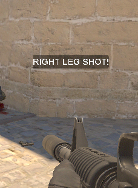

# KillShotHUD


Displays a HUD message based on where a player landed a killshot..

# Requirements
[Latest release of Counter Strike Sharp](https://github.com/roflmuffin/CounterStrikeSharp)
[CS2-GameHUD](https://github.com/darkerz7/CS2-GameHUD/tree/main)


# Instalation
- Download the latest release from [KillShotHUD](https://github.com/M1Kac/KillShotHUD/releases))
- Extract the .zip file into `addons/counterstrikesharp/plugins`
- Enjoy




### Configuration

Configuration file generated on addons/counterstrikesharp/configs/plugins/KillShotHUD/KillShotHUD.json
```json
{
  "MessageBackground": true,
  "HeadshotColor": "Aqua",
  "ChestShotColor": "Yellow",
  "StomachShotColor": "Yellow",
  "ArmShotColor": "Lime",
  "LegShotColor": "White",
  "DefaultKillColor": "White",
  "HeadshotMessage": "HEADSHOT!",
  "ChestShotMessage": "CHEST SHOT!",
  "StomachShotMessage": "STOMACH SHOT!",
  "LeftArmShotMessage": "LEFT ARM SHOT!",
  "RightArmShotMessage": "RIGHT ARM SHOT!",
  "LeftLegShotMessage": "LEFT LEG SHOT!",
  "RightLegShotMessage": "RIGHT LEG SHOT!",
  "DefaultKillMessage": "KILL!",
  "ConfigVersion": 1
}
```
